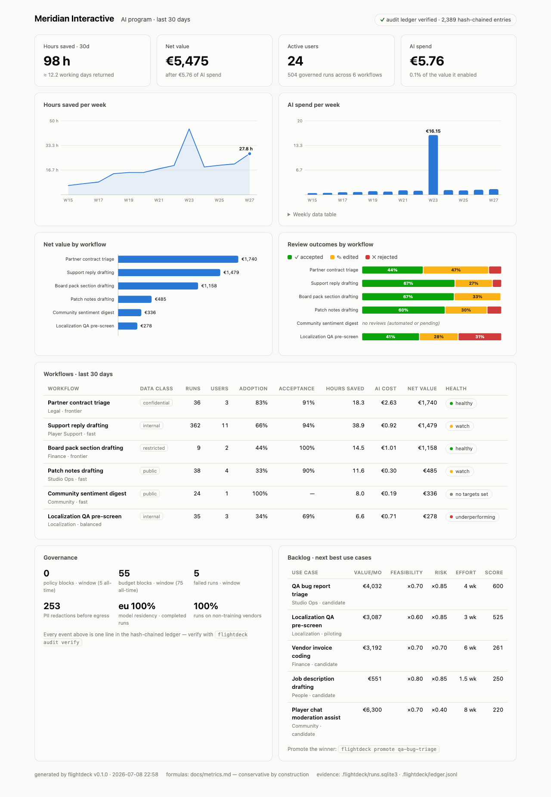
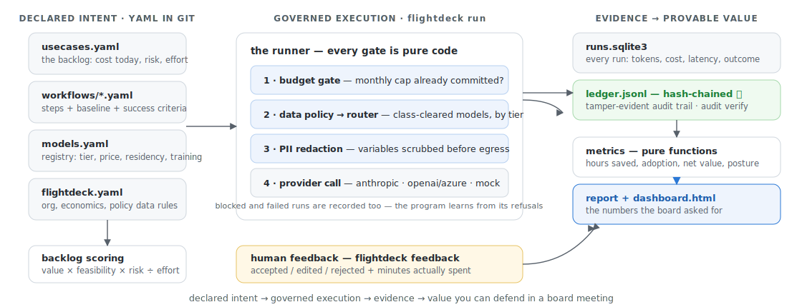

# flightdeck

[](https://github.com/sturlese/flightdeck/actions/workflows/ci.yml)
[](LICENSE)
[](pyproject.toml)

**The open-source flight deck for enterprise AI adoption — declare AI use cases as code, run
them under policy, and prove the value with numbers a CFO can audit.**

Most AI programs can demo everything and prove nothing: pilots everywhere, a survey that says
people "feel faster", and a token bill nobody can map to a business outcome. flightdeck is the
missing operating layer — a small, deterministic system that treats **adoption itself as the
product**: every workflow declares the human baseline it must beat, every run is governed and
recorded, every human verdict feeds the scorecard, and the dashboard answers the only questions
a board actually asks: *hours saved, cost, adoption, risk — says who?*

The design in one sentence: **the workflow does the work; the ledger proves the value** — and
every number that claims to be evidence is computed by pure code from recorded facts, never
estimated by a model.

<p align="center">
  <picture>
    <source media="(prefers-color-scheme: dark)" srcset="docs/assets/dashboard-dark.png">
    
  </picture>
</p>

## Try it in 2 minutes (no API keys)

```bash
pip install flightdeck-ai   # or: pipx install flightdeck-ai / pip install -e . from a clone
flightdeck demo
```

Seeds **Meridian Interactive**, a fictional games publisher 13 weeks into its AI program, and
writes `flightdeck-demo/dashboard.html`. The dataset is deliberately not a highlight reel — it
contains the three things every real program meets:

- an **honest failure**: the localization pilot misses its acceptance bar and the scorecard
  flags it `underperforming` — a scorecard that can say *kill this pilot* is the point;
- a **fail-closed launch**: the board-pack workflow ran before its restricted-data allowlist
  was approved — weeks 1–2 are blocked runs, and the ledger kept the receipts;
- a **runaway bot**: a retry storm on a frontier model blows a monthly budget cap in week 9 —
  the cap absorbs it, the cost chart wears the spike, and the savings math refuses to count
  duplicate work (see the monthly cap rule below).

Everything runs offline on a deterministic mock provider; swap real vendors into `models.yaml`
when you mean it.

## If you only have 5 minutes

| Look at | Why it's interesting |
|---|---|
| [`runner.py`](src/flightdeck/runner.py) | one governed execution: budget gate → data-policy routing → PII redaction → provider → evidence; blocked and failed runs are recorded, not swallowed |
| [`metrics.py`](src/flightdeck/metrics.py) | the savings model: rejected outputs earn **negative** minutes, unmeasured earns nothing, and no workflow can claim more hours than the task volume it declared |
| [`ledger.py`](src/flightdeck/ledger.py) | the audit trail: append-only, hash-chained JSONL — `flightdeck audit verify` re-walks the chain in pure code |
| [`policy.py`](src/flightdeck/policy.py) + [`router.py`](src/flightdeck/router.py) | governance as code: data classification → cleared models → cheapest in tier, escalate up, never violate, fail closed |
| [`demo_org/`](src/flightdeck/demo_org) | what an org looks like as files: policy, registry, six workflows with baselines and kill criteria |
| [`docs/metrics.md`](docs/metrics.md) | every formula written down — a number nobody can recompute is a number nobody should present |
| [`docs/decisions/`](docs/decisions) | four ADRs recording *why*, including what was deliberately NOT built |

## The operating loop

An AI transformation, as a command sequence:

```bash
flightdeck init                      # an org is a directory of reviewable YAML
flightdeck backlog                   # rank use cases: value × feasibility × risk ÷ effort
flightdeck promote qa-bug-triage     # winner becomes a workflow file (baseline included)

flightdeck run support-reply-drafting \
    --var ticket='I was double charged' --var kb_excerpt='Refunds: ...'
                                     # governed: budget → policy → redaction → model → recorded

flightdeck feedback a3f2c81d --outcome edited --minutes 4
                                     # the human verdict — ROI feeds on this, not on tokens

flightdeck report                    # adoption, hours, net value, health — in the terminal
flightdeck report --html board.html  # …or as a self-contained executive dashboard
flightdeck policy check contract-triage   # dry-run the gates: what would run, where, why
flightdeck audit verify              # re-walk the hash chain; exit 1 on tampering
```

Each workflow file declares the three things pilots forget to write down — the **baseline** it
must beat, the **data classification** that gates where it may run, and the **success criteria**
that decide scale-or-kill:

```yaml
id: support-reply-drafting
data_classification: internal     # policy decides which models may see this data
tier: fast                        # you declare capability, the router picks the model
review: human_in_the_loop
baseline:
  minutes_per_task: 12            # no baseline, no ROI claim — this block is mandatory
  tasks_per_month: 640
steps:
  - id: draft
    vars: [ticket, kb_excerpt]
    prompt: |
      Draft a reply to the ticket below. Ground every claim in the KB excerpt...
guardrails:
  redact_pii: true
  monthly_budget: 120             # fails closed, visibly, when exhausted
success:
  weekly_active_users_target: 10  # declared before the pilot, so nobody moves the goalposts
  acceptance_target: 0.80
```

## How the numbers stay honest

Four rules, enforced in code and spelled out in [docs/metrics.md](docs/metrics.md):

1. **Unmeasured is not saved.** A human-in-the-loop run nobody reviewed earns zero minutes.
2. **Rejected outputs earn negative savings.** They consumed review time and produced nothing.
3. **No run earns more than its own baseline**, and **no workflow earns more per month than
   the task volume it declared** — a retry loop cannot inflate the dashboard.
4. **Time is the only claimed benefit.** Quality, speed-to-answer and morale are real, but they
   are not minutes, so they are not in these numbers.

When in doubt, the model understates. A conservative number you can defend beats an impressive
one you have to walk back.

## Where it fits

**LLM observability** (Langfuse, Helicone, vendor consoles) tells you what your LLM calls did —
traces, tokens, latency. flightdeck answers a different question: *what is the AI program worth,
and is anyone actually using it?* — baselines, human verdicts, adoption denominators, and an
audit trail. Run both; they meet at the provider call.

**Gateways** (LiteLLM, Portkey, Kong AI) proxy traffic and enforce limits at the network edge.
flightdeck deliberately **wraps instead of proxying** ([ADR 003](docs/decisions/003-wrap-dont-proxy.md)):
policy runs in-process before the payload leaves, so residency and no-training rules are decided
where the business context lives. A gateway composes fine underneath via `base_url`.

**Copilot adoption dashboards** (e.g. Microsoft's) measure one vendor's tool from the inside.
flightdeck is vendor-neutral by construction — Anthropic, OpenAI/Azure, or anything behind an
adapter — because a transformation program shouldn't get its scorecard from the party selling
the licenses.

**Agent frameworks** (PydanticAI, LangGraph, vendor SDKs) own orchestration. flightdeck's
workflows are deliberately simple templated steps — repeatable tasks with comparable baselines.
Teams running richer agents keep them, and bring the runs under the same ledger and reports
through a [custom provider adapter](docs/architecture.md#custom-providers).

## Architecture

<p align="center">
  
</p>

Small, deterministic core — the LLM is only ever on the other side of a provider adapter:

| Module | Role |
|---|---|
| `schemas.py` / `config.py` | the domain, typed and strictly validated; an org is a directory of YAML in git |
| `policy.py` / `redact.py` / `router.py` | governance as code: data rules, PII scrubbing, quality-tiered routing |
| `runner.py` | one governed execution, evidence recorded on every path |
| `store.py` / `ledger.py` | SQLite evidence + tamper-evident audit chain |
| `metrics.py` / `backlog.py` | pure functions from evidence to KPIs and priorities |
| `report/` | terminal report + self-contained HTML dashboard (no CDNs, mailable, printable) |
| `providers/` | anthropic · openai/azure · mock — one method, bring your own |

More in [docs/architecture.md](docs/architecture.md) · governance details in
[docs/governance.md](docs/governance.md) · rollout method in the
[90-day playbook](docs/playbook.md).

## What flightdeck is not

- **Not a gateway or DLP suite.** The policy engine governs what *flightdeck* sends; the
  redactor is a seatbelt, not a compliance program. Threat model in [docs/governance.md](docs/governance.md).
- **Not an agent framework.** No tool-calling, no loops, no memory — on purpose. Repeatability
  is what makes baselines meaningful.
- **Not a BI platform.** One decision-grade dashboard, not a query builder.
- **Not a court-grade audit system.** The ledger is tamper-*evident* (any edit breaks the
  chain), single-writer by design — [ADR 002](docs/decisions/002-hash-chained-ledger.md).

## Install

```bash
pip install flightdeck-ai                # core: offline mock provider, all commands
pip install 'flightdeck-ai[anthropic]'   # + Anthropic (ANTHROPIC_API_KEY)
pip install 'flightdeck-ai[openai]'      # + OpenAI / Azure OpenAI (OPENAI_API_KEY)
```

Python 3.11+. Development: `make install test lint` — the suite is offline and fast, CI runs
tests (85% coverage gate), ruff, and the full demo end-to-end.

## Related

Part of a family of AI-operations blueprints: [cortex](https://github.com/sturlese/cortex)
(a verified company-brain pipeline — what the org *knows*) and
[claude-squad](https://github.com/sturlese/claude-squad) (role-separated AI engineering —
how the org *builds*). flightdeck is the third leg: whether the AI program is *worth it*.

## License

MIT
